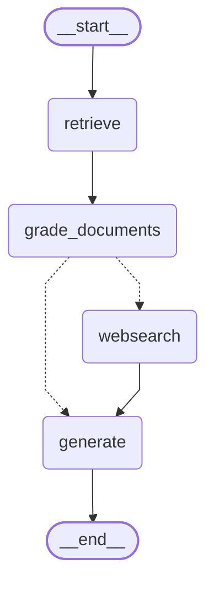
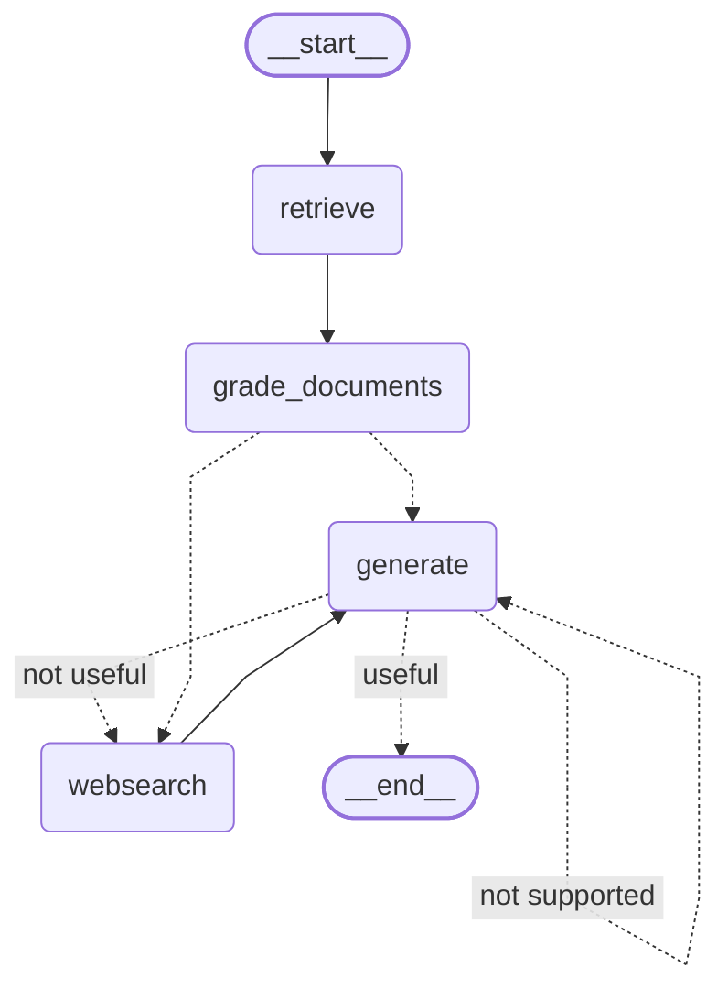
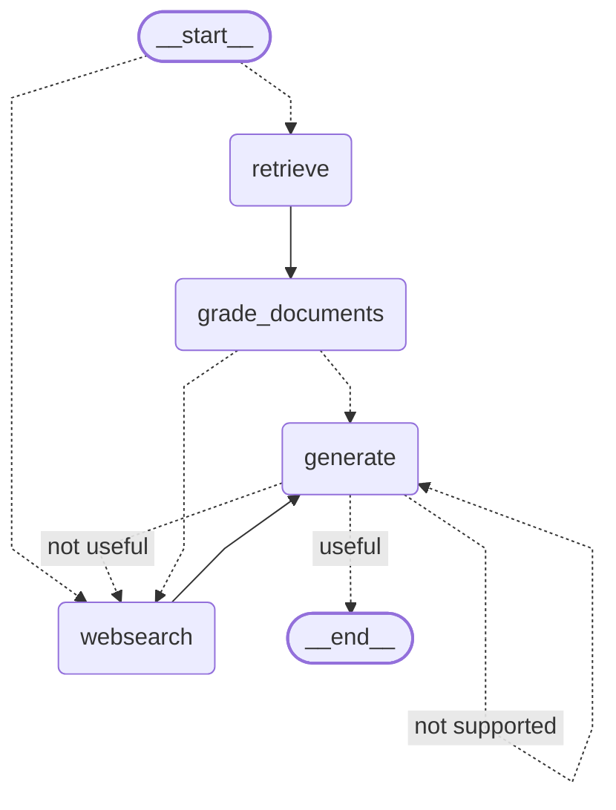

# Agentic RAG

An advanced Retrieval-Augmented Generation (RAG) system built with [LangGraph](https://python.langchain.com/docs/langgraph) and [LangChain](https://python.langchain.com/docs/get_started/introduction). This project implements dynamic routing, document grading, self-correction (hallucination checking), and web search fallbacks to ensure high-quality, grounded, and accurate answers.

## 🌿 Branches / Save Points & Architectures

This project contains three distinct branches that serve as save points, demonstrating the step-by-step evolution of the RAG system:

### 1. `rag` Branch (Baseline RAG)
A standard baseline Retrieval-Augmented Generation implementation where documents are retrieved and directly passed to the generator.



### 2. `self-rag` Branch (Self-Reflective RAG)
Adds self-reflection mechanisms: grading documents for relevance, checking for hallucinations, and ensuring the answer addresses the question.



### 3. `adaptive-rag` Branch (Adaptive RAG)
The complete system (current main) with dynamic query routing based on the user's question, combined with the self-reflection from Self-RAG.



## ✨ Features

- **Dynamic Routing**: Intelligently routes incoming queries to either a local Vectorstore (RAG) or Tavily Web Search based on the topic.
- **Document Grading**: Evaluates retrieved documents for relevance before proceeding to generation. Irrelevant documents trigger a fallback to web search.
- **Self-Correction (Self RAG)**: Checks the generated answer for hallucinations against the retrieved context and validates that it adequately addresses the original question. If the check fails, the system retries or falls back to web search.
- **Adaptive Control Flow**: Combines retrieval, generation, and validation steps in a graph-based workflow that adaptively chooses the best path to produce a grounded and useful answer.

## 🛠️ Tech Stack

- **Frameworks**: [LangGraph](https://python.langchain.com/docs/langgraph), [LangChain](https://python.langchain.com/docs/get_started/introduction)
- **Vector Database**: [ChromaDB](https://www.trychroma.com/) (Local)
- **Embeddings/LLM**: [NVIDIA AI Endpoints](https://build.nvidia.com/) (using `langchain-nvidia-ai-endpoints`)
- **Web Search**: [Tavily](https://tavily.com/)
- **Document Ingestion**: `BeautifulSoup4` for parsing web content

## 🚀 Getting Started

### Prerequisites

- Python >= 3.12
- An NVIDIA AI Endpoints API Key
- A Tavily API Key

### Installation

1. Clone the repository and navigate to the project directory.
2. Install the required dependencies:
   ```bash
   pip install -r requirements.txt # Or use your preferred package manager (e.g., uv, poetry)
   ```

3. Set up your environment variables. Copy the `.env.example` to `.env` and add your keys:
   ```env
   NVIDIA_API_KEY=your_nvidia_api_key
   TAVILY_API_KEY=your_tavily_api_key
   # Add any other required keys
   ```

### Usage

1. **Ingest Data**: First, populate the ChromaDB vector store by running the ingestion script. This will scrape the configured URLs and store the embedded documents locally.
   ```bash
   python ingestion.py
   ```

2. **Run the Graph**: Execute the main script to run the Agentic RAG workflow.
   ```bash
   python main.py
   ```

## 📊 Graph Architecture

The workflow is orchestrated using LangGraph's `StateGraph`, connecting nodes for Retrieval, Grading, Web Search, and Generation with conditional edges based on the grading outcomes. A visual representation of the graph is generated automatically as `graph.png` when you run the application.
